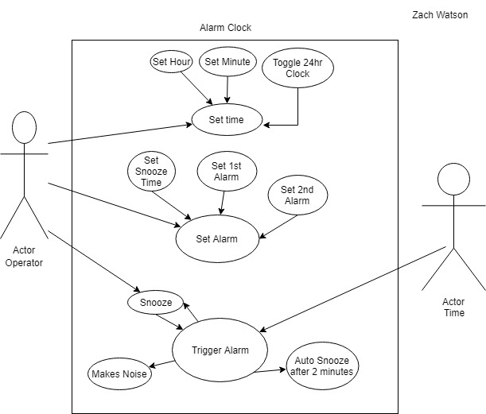

# AlarmClockUseCase
Alarm clock use case diagram and description

|ID:|UC_01|
|Title:|Set Time|
|Description:|The user will set the clock to the current time|
|Primary Actor:|The Operator|
|Preconditions:|The Clock is plugged in|
|Postconditions:|The clock will display the time|
|Main Success Scenario:|The user will use two buttons; the minute and hour buttons. To set the time and it will be displayed on the clock|
|Extensions:|Error checking to only enter valid times, and checking if the 12hr or 24hr switch is toggled.|
|Frequency of Use:|The first time the clock is plugged in or whenever it is taken off and reconnected to power.|
|Priority:|High – Basic functionality of clock|

ID: 	UC_02
Title:	Set Alarm
Description:	The user will set what time the alarm will go off and has the option of setting 2 alarms. The snooze timer can also be set here. 
Primary Actor:	The Operator
Preconditions:	The Clock is plugged in and the time is set.
Postconditions:	The clock will display the time and have an alarm go off whenever the set time is reached and the snooze button will be available to snooze the alarm for the set amount of time. 
Main Success Scenario:	The user will use two buttons; the minute and hour buttons. To set the what time either alarm will go off. The user has also set the snooze timer to their desired interval. 
Extensions:	Error checking to only enter valid times and valid snooze times. 
Frequency of Use:	Each time the user wants to set a new alarm. 
Priority:	High – Basic functionality of an alarm clock

ID: 	UC_03
Title:	Trigger Alarm
Description:	When the set time is reached, an alarm will sound
Primary Actor:	Time
Preconditions:	The alarm is set
Postconditions:	The clock will generate noise
Main Success Scenario:	The set time is reached, the alarm goes off and wakes up the individual who set it.
Extensions:	Making sure that the time reached is the set time for the alarm, checking to see if the alarm has been triggered, and check to see if it is making noise. 
Frequency of Use:	Each time the alarm set time is reached
Priority:	High – Basic functionality of an alarm clock

